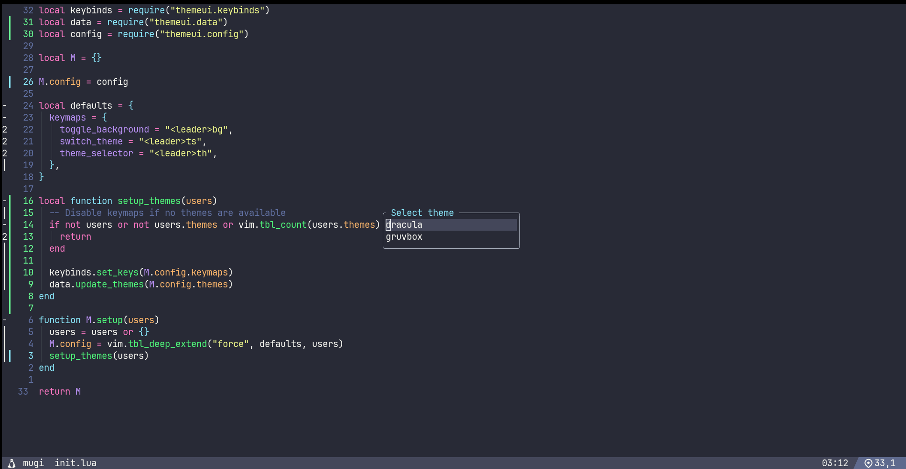
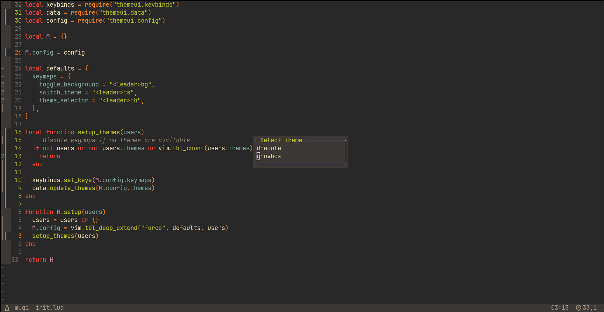

ThemeUI
=======

Simple theme selector app that uses Nui and third party themes.

Table of Contents
-----------------

-	[Features](#features)
-	[Keybindings](#keybindings)
-	[Installation](#installation)
-	[Screenshots](#screenshots)
-	[License](#license)

Features
--------

-	Simple theme selector plugin
-	Supports multiple themes
-	Supports background mode selection (dark/light[^1])

[^1]: For dracula theme light background mode is not available, so light mode is replaced with transparent background

Keybindings
-----------

| Key                                         | Action                             |
|---------------------------------------------|------------------------------------|
| <kbd>leader</kbd> <kbd>t</kbd> <kbd>h</kbd> | Open colorscheme selection menu    |
| <kbd>leader</kbd> <kbd>t</kbd> <kbd>s</kbd> | Toggle colorscheme in sequentially |
| <kbd>leader</kbd> <kbd>b</kbd> <kbd>g</kbd> | Toggle background mode             |

Installation
------------

### Using lazy.nvim

```lua
{
  "yashodhanketkar/themeui.nvim",
  dependencies = {
    "MunifTanjim/nui.nvim",
    "Mofiqul/dracula.nvim",
    "ellisonleao/gruvbox.nvim", -- optional
    -- add more themes here
  },
  config = function()
    require("themeui").setup({
      themes = {
        "dracula",
        "gruvbox", -- optional
        -- add themes name here
      },
    })
  end,
}
```

Screenshots
-----------

<details>
  <summary>Examples</summary>

dracula


gruvbox

</details>

License
-------

[MIT License](./LICENSE)

Copyright (c) 2025 Yashodhan Ketkar
